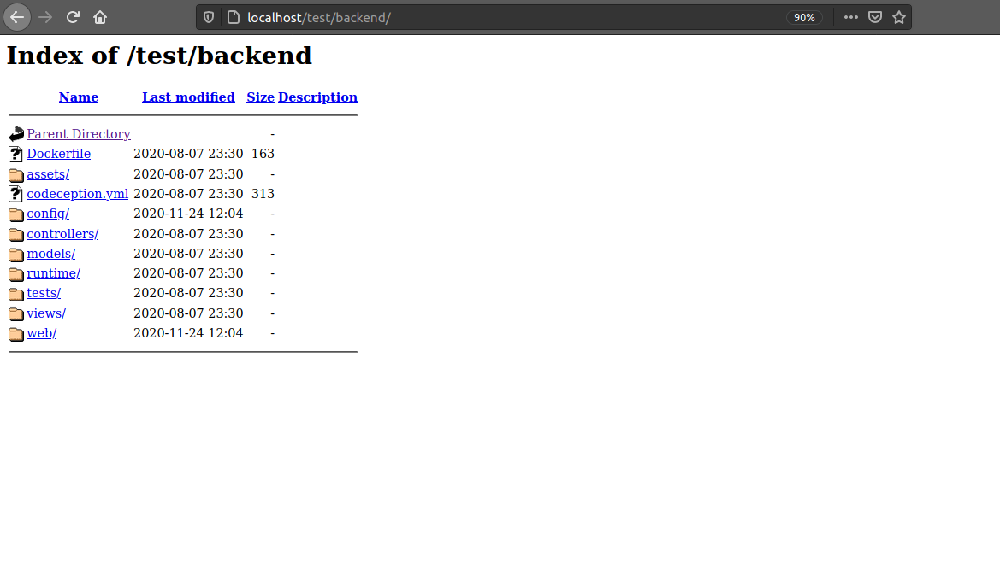
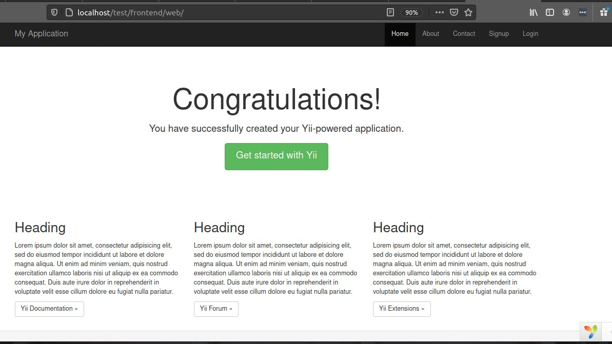
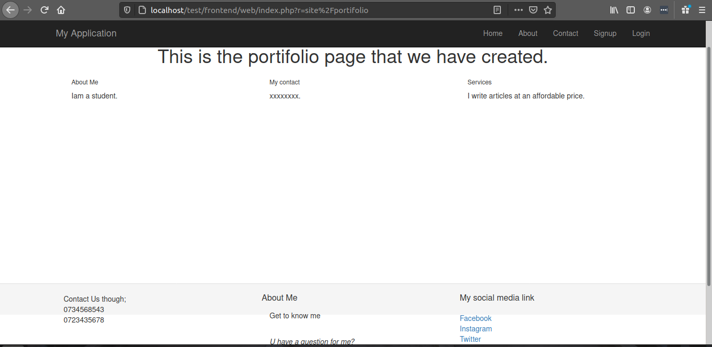

## Php yii2 Web Application framework.
 
Nowadays,many people has turned out to use framework in web designing and apps development. This has played a great role in improving developers codding skill since they done have to have the whole knowledge of a language so as to use it.
PHP is an acronym for "PHP: Hypertext Preprocessor".It is a server side scripting language that is embedded in HTML. It is used to manage dynamic content, databases, session tracking, even build entire e-commerce sites.
It is integrated with a number of popular databases, including MySQL, PostgreSQL,
Oracle, Sybase, Informix, and Microsoft SQL Server.
takeaway
## Introduction
Yii is a generic Web programming framework best for developing complex Web applications with multiple ties.
It is used together with database.When developing webs with yii2, you need to be familia with php classes and objects.
Like other PHP frameworks,Yii implements the MVC (Model-View-Controller) . 

MVC aims to separate business logic from user interface considerations, so that developers can more easily change each part without affecting the other. 

    1 Model
     Models represent the information (data) and the business rules.They are often shared among different sub-applications of a Web application. For example, a LoginForm model may be used by both the front end and the back end of an application.
     Models should;

     - contain properties to represent specific data.

     - contain business logic(eg validation riles)to ensure the represented data fulfills the design requirement.
     
     - avoid direct access to $_GET, $_POST, or other similar variables that represent the end user request.

     2 Views
     Views are responsible in representing models in the format that end users desire.

     Views should;
     -  mainly contain presentational code, such as HTML, and simple PHP code to traverse, format and render data.
     - avoid containing code that performs explicit DB queries. Such code is better placed in models.
     - avoid direct access to $_GET, $_POST, or other similar variables that represent the end user request.

     3 Controller
     (link(Controller[https://www.yiiframework.com/doc/guide/1.1/en/basics.controller])) binds models,views and other components together into a runnable application.RThey are responsible for dealing with directly with end user request. Therefore,controllers

     - may access $_GET, $_POST and other PHP variables that represent user requests;

     - should avoid containing any HTML or any other presentational markup. This is kept in views.

     - may create model instances and manage their life cycles. For example, in a typical model update action, the controller may first create the model instance; then populate the model with the user input from $_POST; after saving the model successfully, the controller may redirect the user browser to the model detail page.

It include three tiers:frontend,backend and console, each of which is a separate Yii console.

- front end: it is a public-facing website for normal end users.

- back end: it exposes administrative functionality for managing the application. It is restricted to administrative staff.

- console: an application consisting of console commands to be run in a terminal window or as scheduled jobs to support the whole application.

In this article we are going to focuses on frontend. 

## Requirements
To follow along with this tutorial,you need to; 
- install a code editor like sublime or vscode.feel free to use any other. 
- install yii2.Procedures of installing are well described in this article.
- have some knowledge of html and css 
- have knowledge of OOP (Object oriented programming). This means classes, overriding functions, using constructor, public and private methods and properties.
- be familiar with databases (DB) .
- have Web server supports PHP 5.6.0.Yii2 is a PHP( server side scripting language) framework therefore it require a web server support.
 
## step 1- install yii2
Yii is installed in two ways, using the Composer package manager or by installing it from an archive file. The former is the recommended way, as it enables you to install new extensions or update Yii by a single command.

## 1. install via composer
If you do not have a composer with you in your PC you may install it by following the instruction at https://getcomposer.org/download/.
On linux and Mac OS X, you will run the following commands:

```bash
$ curl -sS https://getcomposer.org/installer | php
$ sudo mv composer.phar /usr/local/bin/composer
$ sudo chmod +x /usr/local/bin/composer
```

On Windows,you'll download and run https://getcomposer.org/Composer-Setup.exe.

If you encounter a problem,please refer to https://getcomposer.org/doc/articles/troubleshooting.md

 have composer installed, move into the directory /var/www/html/ which will store your web applications or websites files, then install the Yii package using the composer (replace testproject with the name of your web application’s directory). 
```bash
$ cd /var/www/html/
$ composer create-project --prefer-dist yiisoft/yii2-app-basic testproject

```

The command above will install the latest version of YII in the basic directory.
In case of an error,please refer[Troubleshooting section of th Composer Documentation](https://getcomposer.org/doc/articles/troubleshooting.md),then resume to the installation by running composer updates inside of the basic directory.


## 2. install from an archive file.
This Involves three steps;

1.Download the archive file from [yiiframeworks.com](https://www.yiiframework.com/download).

2.Unpack the download file to a web-accessible folder. <!-- what is a web accessible folder? -->

3.Modify the config/web.php file by entering a secret key for the cookieValidationkey configuration item.
<!-- if cookieValidationkey is a name then put it under some code blocks -->
NB if you install yii using composer this will done automatically for you. <!-- specify what "this" stands for -->
```php
// !!! insert a secret key in the following(if it is empty) - this is required by cookie validation
'cookieValidationKey' =>'enter you secret key here',
```
 ## step2 verify the installation
 At this point, you are ready to start using the Yii framework for development. 
 After your done with the installation,you can either configure your web server or use the build in server[bult-in-web server](https://www.php.net/manual/en/features.commandline.webserver.php)by running the following command in you terminal while in the project directory .
 
 ```bash
 $ php yii serve
 ```

 ### Understanding the Folder Structure and directories
 
 First, let's check what happens when we just open the advanced template in the browser. So now if you have the advanced directory correctly in the document root, you can  use your browser to access the following URL:
 ```
 http://localhost/advanced
 ```
 NB.You can rename  the `advanced` from `advanced` to any favorite name that you think about.later we will see how we rename.
You should see the following directories on your code editor; 
```bash
/
	backend/
	common/
		components/
		config/
			params.php
			params-local.php *
		lib/
			Pear/
			yii/
			Zend/
		migrations/
		models/
			Comment.php
			Extension.php
			...
	console/
		commands/
			SitemapCommand.php
			...
		config/
			main.php
			main-local.php *
			params.php
			params-local.php *
		runtime/
		yiic.php *
	frontend/
		components/
		config/
			main.php
			main-local.php *
			params.php
			params-local.php *
		controllers/
			SiteController.php
			...
		lib/
		models/	
			ContactForm.php
			SearchForm.php		
		runtime/
		views/
			layouts/
			site/
		www/
			assets/
			css/
			js/
			index.php *
	yiic
	yiic.bat

```

Here, we will cover the just the necessary directories and files. In advanced series.
At the top level, we have four directories;

- backend

In the development of any web application, we have two things to be considered, the consumer/user facing side of the website and the admin panel or the dashboard.
The backend directory serve the service of admin or the services which are restricted from the users.
Now lets see whats inside the backend.Inside backend we have the following directories. 

## assets
This directory consists the configurations for the assets managed in the backend project. By default, it has AppAsset.php file inside, which includes the configurations of the javascript and the css files.This is where we will adding all our css and js styles link
## controllers
In the MVC Pattern of coding, the C stands for Controllers. These controllers are present in the controller's directory. Yii follows the convention of <NameController> for naming the controllers. Example, UserController.php is the name of the file and the class is UserController.
## models
Models are the classes which contain the 'business logic'. When we say business logic it's the processing of data, manipulating the values, etc. In Yii, this directory also has classes which are a link to the Database through which we can access the database tables. These models and tables have one to one mapping.
## views
Views store the files which are displayed via a browser. The data is passed from the controller in the view and then sent to the browser in HTML format. Thus separating the business logic in Models and display logic in Views. 
## Creating views
As mentioned before,a view is simply a PHP script mixed with HTML and PHP code.PHP generate the dynamic content,such as the page title and the form,while HTML organizes them into a HTML page.Below is code for a login form,
```
<?php
use yii\helpers\Html;
use yii\widgets\ActiveForm;

/* @var $this yii\web\View */
/* @var $form yii\widgets\ActiveForm */
/* @var $model app\models\LoginForm */

$this->title = 'Login';
?>
<h1><?= Html::encode($this->title) ?></h1>

<p>Please fill out the following fields to login:</p>

<?php $form = ActiveForm::begin(); ?>
    <?= $form->field($model, 'username') ?>
    <?= $form->field($model, 'password')->passwordInput() ?>
    <?= Html::submitButton('Login') ?>
<?php ActiveForm::end(); ?>
```

Inside views we have two directories;
1. **layout**
Layouts are a special type of views that represent the common parts of multiple views. For example, the pages for most Web applications share the same page header and footer. 
Instead of repeating the same page header and the footer in every view,a better way is to do this layout embed the rendering result of a content view at an appropriate place in the layout.
The files in this directory are under main.php folder .In our case this is the codding we have under main.php;


```php
//...
<?php $this->beginBody() ?>

<div class="wrap">
    <?php
    NavBar::begin([
        'brandLabel' => Yii::$app->name,
        'brandUrl' => Yii::$app->homeUrl,
        'options' => [
            'class' => 'navbar-inverse navbar-fixed-top',
        ],
    ]);
    $menuItems = [
        ['label' => 'Home', 'url' => ['/site/index']],
        ['label' => 'About', 'url' => ['/site/about']],
        ['label' => 'Contact', 'url' => ['/site/contact']],
    ];
    if (Yii::$app->user->isGuest) {
        $menuItems[] = ['label' => 'Signup', 'url' => ['/site/signup']];
        $menuItems[] = ['label' => 'Login', 'url' => ['/site/login']];
    } else {
        $menuItems[] = '<li>'
            . Html::beginForm(['/site/logout'], 'post')
            . Html::submitButton(
                'Logout (' . Yii::$app->user->identity->username . ')',
                ['class' => 'btn btn-link logout']
            )
            . Html::endForm()
            . '</li>';
    }
    echo Nav::widget([
        'options' => ['class' => 'navbar-nav navbar-right'],
        'items' => $menuItems,
    ]);
    NavBar::end();
    ?>

    <div class="container">
        <?= Breadcrumbs::widget([
            'links' => isset($this->params['breadcrumbs']) ? $this->params['breadcrumbs'] : [],
        ]) ?>
        <?= Alert::widget() ?>
        <?= $content ?>
    </div>
</div>

<footer class="footer">
    <div class="container">
        <p class="pull-left">&copy; <?= Html::encode(Yii::$app->name) ?> <?= date('Y') ?></p>

        <p class="pull-right"><?= Yii::powered() ?></p>
    </div>
</footer>

<?php $this->endBody() ?>
// ...

```
2) Site
Unlike files in layout,files in site are not fixed.That is,one page does not have the same view with another page.The only similar thing is the header and footer. since it was placed in main.php
In our case, we have the following code inside  about.php files which is a file in site directory.;
```php
<?php

/* @var $this yii\web\View */

use yii\helpers\Html;

$this->title = 'About';
$this->params['breadcrumbs'][] = $this->title;
?>
<div class="site-about">
    <h1><?= Html::encode($this->title) ?></h1>

    <p>This is the About page. You may modify the following file to customize its content:</p>

    <code><?= __FILE__ ?></code>
</div>
```
## common
In this directory we have files that are common to all application.

As the name suggests, the common directory has the config, models, etc. which are used in the backend and the frontend projects. For example, you can have database configuration in common/config if, both of them uses the same database. We will look at database configuration later as we move forward.

- frontend

The frontend application provides the main interfaces to our target end users.The user interacts with the frontend but does not have access to the backend.
Frontend has similar directories to those of backend. 


## Database configuration
Let us now configure our database.
Edit the file config/main-local.php in the Backend directory:
Change the dbname from y112advanced to your favorite name,lets say test.You should have the following;

```php
<?php
return [
    'components' => [
        'db' => [
            'class' => 'yii\db\Connection',
            'dsn' => 'mysql:host=localhost;dbname=test',
            'username' => 'root',
            'password' => '',
            'charset' => 'utf8',
        ],
        'mailer' => [
            'class' => 'yii\swiftmailer\Mailer',
            'viewPath' => '@common/mail',
            // send all mails to a file by default. You have to set
            // 'useFileTransport' to false and configure a transport
            // for the mailer to send real emails.
            'useFileTransport' => true,
        ],
    ],
];
```

## step 3  accessing the installed Yii application using a browser
Use your browser to access the installed Yii application. Open your browser and navigate, 
```
http:localhost/test
```
Test is the name that we renamed our yiiadvanced name to.
You should first see the following directory;
```bash
Index of /test
[ICO]	Name	Last modified	Size	Description
[PARENTDIR]	Parent Directory 	 	- 	 
[ ]	LICENSE.md 	2020-08-07 23:30 	1.5K	 
[ ]	Vagrantfile 	2020-08-07 23:30 	2.6K	 
[DIR]	backend/ 	2020-08-07 23:30 	- 	 
[ ]	codeception.yml 	2020-08-07 23:30 	167 	 
[DIR]	common/ 	2020-08-07 23:30 	- 	 
[ ]	composer.json 	2020-08-07 23:30 	1.4K	 
[ ]	composer.lock 	2020-08-07 23:31 	169K	 
[DIR]	console/ 	2020-08-07 23:30 	- 	 
[ ]	docker-compose.yml 	2020-08-07 23:30 	864 	 
[DIR]	environments/ 	2020-08-07 23:30 	- 	 
[DIR]	frontend/ 	2020-08-07 23:30 	- 	 
[ ]	init 	2020-08-07 23:30 	8.6K	 
[ ]	init.bat 	2020-08-07 23:30 	319 	 
[ ]	requirements.php 	2020-08-07 23:30 	5.7K	 
[DIR]	vagrant/ 	2020-08-07 23:30 	- 	 
[DIR]	vendor/ 	2020-08-07 23:31 	- 	 
[ ]	yii 	2020-11-22 22:36 	717 	 
[ ]	yii.bat 	2020-08-07 23:30 	323 	 
[ ]	yii_test 	2020-11-22 22:36 	928 	 
[ ]	yii_test.bat 	2020-11-22 22:36 	328 	 
```
Inside frontend directory click the web directory and if the installation was successful you should  see the below "Congratulations!" page in your browser. 




## Congratulation for creating your first yii program.
Nb-If you don't get a congratulation note,just go back a little and follow the steps. 

## Step 4 Creating our first web application using yii 
Now that we have yii installed and working in our pc lets create our first yii frontend project.
We will start by creating the navigation bar and the footer. In our view directory we will open main.php under layout file and  enter the following;
```php
      ---
      <body>
<?php $this->beginBody() ?>

<div class="wrap">
    <li><a href="<?= Yii::$app->urlManager->createUrl(['site/contact'])?>">Contact</a></li>
    <?php
    NavBar::begin([
        'brandLabel' => Yii::$app->name,
        'brandUrl' => Yii::$app->homeUrl,
        'options' => [
            'class' => 'navbar-inverse navbar-fixed-top',
        ],
    ]);
    $menuItems = [

      
        ['label' => 'Home', 'url' => ['/site/index']],
        ['label' => 'About', 'url' => ['/site/about']],
        ['label' => 'Contact', 'url' => ['/site/contact']],
    ];
    if (Yii::$app->user->isGuest) {
        $menuItems[] = ['label' => 'Signup', 'url' => ['/site/signup']];
        $menuItems[] = ['label' => 'Login', 'url' => ['/site/login']];
    } else {
        $menuItems[] = '<li>'
            . Html::beginForm(['/site/logout'], 'post')
            . Html::submitButton(
                'Logout (' . Yii::$app->user->identity->username . ')',
                ['class' => 'btn btn-link logout']
            )
            . Html::endForm()
            . '</li>';
    }
    echo Nav::widget([
        'options' => ['class' => 'navbar-nav navbar-right'],
        'items' => $menuItems,
    ]);
    NavBar::end();
    ?>

    <div class="container">
        <?= Breadcrumbs::widget([
            'links' => isset($this->params['breadcrumbs']) ? $this->params['breadcrumbs'] : [],
        ]) ?>
        <?= Alert::widget() ?>
        <?= $content ?>
    </div>
</div>


<footer class="footer">
    <div class="container">
        <div class="col-md-4">
            <div>
            Contact Us though; <br>
            0734568543 <br>
            0723435678
                
            </div>
        </div>
         <div class="col-md-4">
        <div class="w3l-title">
       <h3  class="panel-title" >About Me</h3>
        </div>
        <div class="panel-body">
         <p>Get to know me</p> <br>
         <div class="social-icons">
         <i class="fa-linkedin">U have a question for me?</i> <br>
         <a href="<?= Yii::$app->urlManager->createUrl(['site/contact'])?>">Contact</a> <br>
         <i class="fa-linkedin">My address</i> <br>
         <p>PO.BOX 292 xxxx <br> PO.BOX 345-10100 xxx</p>
         </div>
         </div>  
        </div>
          <div class="col-md-4">
         <h3 class=panel-title>My social media link</h3> <br>
         <i class=""></i>
         <a href="https://en-gb.facebook.com/">  Facebook </a><br>
         <a href="https://www.instagram.com/">Instagram </a><br>
         <a href="https://twitter.com/home?lang=en">Twitter  </a><br>
         <a href="https://www.google.com/">  Google </a><br>
         <a href="https://web.whatsapp.com/">Whatsapp </a><br>
      </div>
        <br> <br>
        <div class="col-md-12">
            <div class="footer-copyright text-center py-3">© 2020 Copyright:
              <a href="https://mdbtrap.com/"> MDBootstrap.com</a>
            </div>

        </div>

    </div>

  
</footer>
<?php $this->endBody() ?>
</body>
      ---
```
In the above code we have used PHP URL manager to root.

As we had discussed earlier about styles all your styles should be under the directory assets.You add all the css and js styles that you wish to.
```css
{
    public $basePath = '@webroot';
    public $baseUrl = '@web';
    public $css = [
        'css/site.css',
        'css/bootstrap.min.css',
        'css/styles.css',
    ];
    public $js = [
 
```
In our case all the style are in css folder and that how we will be linking  them.

## Body
Now lets modify the body.This will be done inside the index.php file which is in the site directory.
This file contains the entire page of the website..
When we modify the index.php file we will have the code below.We will also add a link that will take us to service page that we are going to create.
```php
<?php

<?php

/* @var $this yii\web\View */

$this->title = 'My Yii Application';
?>
<div class="site-index">

    <div class="jumbotron">

       <h1>Hello World!</h1>
        <p>My first webpage using yii2.</p>
         <h2>Click here <a href="<?= Yii::$app->urlManager->createUrl(['site/portfolio'])?>">Portfolio </a>to go to the portfolio page. </h2>
    
</div>

```
Now lets create a view page called portfolio page.To create a page, we
must create a view and  an action.
Inside views/site folder create a file called portfolio.php.To do this,right click on site to create a new file(portfolio.php) with the following code:
```html
<!DOCTYPE html>
<html>
<head>
	<title>Portfolio</title>
</head>
<body>
     <h1 style="text-align: center">This is the portfolio page that we have created.</h1>
     <div class="container">
     	<div class="col-sm-4">
     		<div class="title">
     			<h6>About Me</h6>
     		</div>
     		<div>Iam a student.</div>
     	</div>
     	<div class="col-sm-4">
     		<div class="title">
     			<h6>My contact</h6>
     		</div>
     		<div>xxxxxxxx.</div>
     	</div>
     	<div class="col-sm-4">
     		<div class="title">
     			<h6>Services</h6>
     		</div>
     		<div>I write articles at an affordable price.</div>
     	</div>
     </div>
     
</body>
</html>
```
Now that we have created a view,lets create an action.

Actions are the objects that end users can directly refer to for execution. Actions are grouped by controllers. The execution result of an action is the response that an end user will receive.

Declare the portfolio action in the existing SiteController, which is defined in the class file
controllers/SiteController.php.
```php
<?php
namespace frontend\controllers;

use frontend\models\ResendVerificationEmailForm;
use frontend\models\VerifyEmailForm;
use Yii;
use yii\base\InvalidArgumentException;
use yii\web\BadRequestHttpException;
use yii\web\Controller;
use yii\filters\VerbFilter;
use yii\filters\AccessControl;
use common\models\LoginForm;
use frontend\models\PasswordResetRequestForm;
use frontend\models\ResetPasswordForm;
use frontend\models\SignupForm;
use frontend\models\ContactForm;

/**
     * Display portfolio  page
     * 
     * @return mixed
     */
    public function actionPortfolio()
     {
         $this->layout='main';
         return $this->render('portfolio');

    }
    // ...
```
After creating the action and the view, you may access the new page by clicking on the portfolio link that is on the main page and your browser should display an image similar to the one below;


In Yii, all action methods are prefixed with the word action. This is how the framework differentiates action methods from non-action ones. If an action ID requires multiple words, then they will be concatenated by
dashes.

To add any other page in yii follow the same same steps above and you will be done.

### Is framework important when codding?
This one depends on you as an individual,some people  will prefer framework while others won't.However,I would recommend someone to use framework especially the beginners since;
1. it is easy to install
2. encourages testing
3. utilizes modern technology


### conclusion
Like any other good framework,Yii help you create modern web application quickly and make sure they perform well.It pushes you to create securable and testable site by doing a lot of the heavy lifting for you.
I really encourage you to check it out for the next web project..
In this article;
- we have installed yii2 framework.
- we have looked at yii2 directories.
- we have created a simple webpage using yii2 framework.

Have You tried yii2??Why not?Try today!


