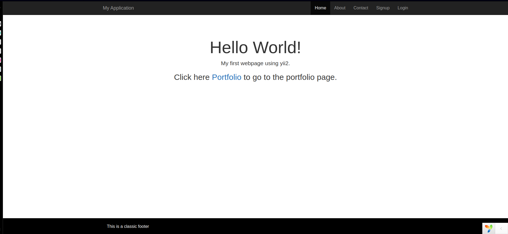

## Getting started with Yii 2 PHP Web framework.
 
Nowadays, many developers have turned to use frameworks in designing websites. This has led to improved production speeds. PHP is  scripting language  used in web development. It is a server-side scripting language that is embedded in [HTML](https://en.wikipedia.org/wiki/HTML). It is used in managing dynamic content, databases, and session tracking. It can be integrated with databases like MySQL, PostgreSQL, and MongoDB to store user data.

## Introduction
Yii 2 is a generic PHP framework used for developing web applications with multiple ties. Like other PHP frameworks, Yii 2 implements the MVC (Model, View, and Controller) development principle.

The work of the MVC is to help the web developers modify each part of the business logic easily without affecting the other. To learn more on MVC click [here](https://www.guru99.com/php-mvc-frameworks.html).

## Prerequisites
To follow along with this tutorial, you are required to have the following:
- a code editor like [Visual Studio Code](https://code.visualstudio.com/download)
- knowledge of PHP, HTML, and CSS
- Apache Web server. You can get it [here](https://www.apachefriends.org/download.html) to download and start the installation. After installation, a folder `/opt/lampp` will be created.

## step 1 -- install Yii 2
Yii 2 can be installed from an archive file.

This involves the following steps"

1. Download the archive file from [yiiframeworks.com](https://www.yiiframework.com/download) In our case we will download the advanced application template.

2. Move the downloaded archive file to the `/htdocs` folder inside xampp installation folder. In my case it is `/opt/lampp/htdocs`.

```bash
$ sudo mv yii-advanced-app-2.0.39.tgz /opt/xampp/htdocs
```
3. Using terminal open the  `/opt/xampp/htdocs` and unzip the Yii-2-advanced file.
```bash
$ sudo tar-xvzf Yii-advanced-app-2.0.39.tgz
```
For assistance with extracting tarball archives, click [here](https://askubuntu.com/questions/499807/how-to-unzip-tgz-file-using-the-terminal).

4. Initialize your project by entering the following command.
```
$ PHP init
```
Then you will be asked which environment you want the application to be initialized in.
Select 0 (Development) ,then click Enter. It will again ask you for Yes/No. Type yes and click enter.

At this point, you have installed  Yii 2 Advanced Template. Open your browser and navigate, http://localhost/advanced/frontend/web to test it.

If you see the Congratulations! page in your browser, it means that the installation was successful.


You can also learn how to configure your web server [here](https://www.php.net/manual/en/features.commandline.webserver.php).
 
### step 2--understanding the Folder Structure and directories
Inside the `advanced` folder, we have the following folder structure: OPen the folder using your favorite code editor.
```bash
.
├── backend
├── codeception.yml
├── common
├── composer.json
├── composer.lock
├── console
├── docker-compose.yml
├── environments
├── frontend
├── init
├── init.bat
├── LICENSE.md
├── README.md
├── requirements.php
├── vagrant
├── Vagrantfile
├── vendor
└── yii.bat
```
In this `advanced` folder, we have three main directories:
1. backend
2. common
3. frontend

Let us look at the work of the above folders:
### Folder 1. backend
The backend directory serves the admin services which are restricted from the users.
Inside this `backend` folder, we have the following main directories.


**`/assets`**: This directory consists of asset configurations. It has an `AppAsset.php` file, which contains the configurations of the CSS and the JAVASCRIPT. This is where we will be adding our CSS and JAVASCRIPT files.


**`/controllers`**: Yii 2 Controller's are written in this folder. Yii 2 takes the convention of <NameController> to name the controllers. For example, `UserController.php` is the name of the file containing `User` controllers.


**`/models`**: In Yii 2, processing of data, and manipulating the values takes place here. In this directory we have classes that link to the databases hence accessing the database tables. Tables in databases and the models has one to one mapping.


**`/views`**: Views store the files that are displayed via a browser. The data to be placed is passed from the controller in the view and then sent to the browser as HTML. 

Inside view we have two directories:

- **`views/layout`**: Layouts are a special type of view that represents the common parts of multiple views. For example, the pages for most Web applications share the same page header and footer. 
Instead of repeating the same page header and the footer in every view, a better way is to do this layout embed the rendering result of a content view at an appropriate place in the layout. The files in this directory are under `main.php` folder.

- **`views/site`**: Unlike files in layout, files in site are not fixed. That is, one page does not have the same view with another page. The only similar thing is the header and the footer since they were placed in `main.php`.

### Folder 2: common
In this directory, we have configurations that are used in the backend and the frontend projects. For example, you can have database configurations in `/common/config`.

### Folder 3: frontend

The `/frontend` project contains the contents displayed to the users. This folder has similar directories to those of `/backend`.

## Step 3--Creating our first web application using Yii 2
Now that we have the default Yii 2 template running, all we have to do is modify the different parts of our website to fit our preferences. Let us modify the footer of our website. Replace the whole `<footer>` in `/frontend/views/layout/main.php` with the following code:

```PHP
// ...
<footer class="footer">
    <div class="container">
        <div class="col-md-6">
            <div>
           <h6>This is a footer</h6>
           <h5>Classic footer</h5>
            </div>
        </div>
        <div class="col-md-12">
            <div class="footer-copyright text-center py-3">© 2020 Copyright:
              <a href="https://mdbtrap.com/"> MDBootstrap.com</a>
            </div>

        </div>

    </div>

  
</footer>

//...

```
### Step 4 -- Configure CSS and JavaScript
All CSS files in a project are stored under `/web/css` and all JavaScript are stored under `/web/js`. 

Let us customize the footer we created above. Create a `footer.css` under `/web/css` and put the code below. 
```css
h6{
    color: red;
    text-align: center;
}
h5:hover{
    color: blue;
}
h5{
    color: violet;
}


```

Then register the styles above in `assets/AppAsset.php`.
```css
/* ... */
{
    public $basePath = '@webroot';
    public $baseUrl = '@web';
    public $css = [
        'css/site.css',
        'css/footer.css',
    ];
    /* ... */
}
```
### Modifying site contents
Now let us modify the contents of our website. Replace the contents of `frontend/views/site/index.php` with the following code:

```PHP
<?PHP

/* @var $this yii\web\View */

$this->title = 'My Website';
?>
<div class="site-index">

    <div class="jumbotron">

       <h1>Hello World!</h1>
       <p>My first yii2 powered site.</p>
       <h2>Here is my <a href="<?= Yii::$app->urlManager->createUrl(['site/portfolio'])?>">Portfolio </a></h2>
    </div>
</div>
```
The code above replaces the default homepage content with bootstrap jumbotron. We also add a link that points to a portfolio page using PHP URL manager. The URL Manager is used to link pages throughout Yii 2 framework. On clicking the link you get a 404 error as the portfolio page does not exist. Let us now create the portfolio page.

### Adding a new page to our website
To add a new page to our website, we need to create a view and an action. A view is the code that will be displayed in the browser. Create a new file `frontend/views/site/portfolio.php` and put the following code:

```html
<!DOCTYPE html>
<html>
<head>
	<title>Portfolio</title>
</head>
<body>
     <h1 style="text-align: center">This is the portfolio page</h1>
     <div class="container">
     	<div class="col-sm-4">
     		<div class="title">
     			<h6>About Me</h6>
     		</div>
     		<div>I am a student.</div>
     	</div>
     </div>
     
</body>
</html>
```
For the above view code to work, we need to create an action. Actions are the objects that end users can directly refer to for execution. Actions are grouped by controllers. The execution result of an action is the response that an end-user will receive.

To display the portfolio page, we need to declare an action to display the portfolio page. Open  `frontend/controllers/SiteController.php` and add the following:
```PHP
<?PHP
// ...
class SiteController extends Controller
{
// ...

/**
     * Displays portfolio  page
     * 
     * @return mixed
     */
    public function actionPortfolio()
     {
         $this->layout='main';
         return $this->render('portfolio');

    }

}
```
After creating the action and the view, you can access the new page by clicking on "Portfolio" on the main page.

You should have a page similar to the one below;

In Yii, all action methods are prefixed with the word action. This is how the framework differentiates action methods from non-action ones. If an action ID requires multiple words, then they will be concatenated by dashes.

### conclusion
Congratulations! Now you have a better understanding of the basics of Yii 2 framework.
Yii 2 pushes you to create securable and testable site by doing a lot of the heavy lifting for you.
I encourage you to use Yii 2 in your next project.
In this article;
- we have installed Yii 2 framework.
- we have looked at Yii 2 directories.
- we have created a portfolio page using yii2.

**Have a good Yii 2 coding ahead**
