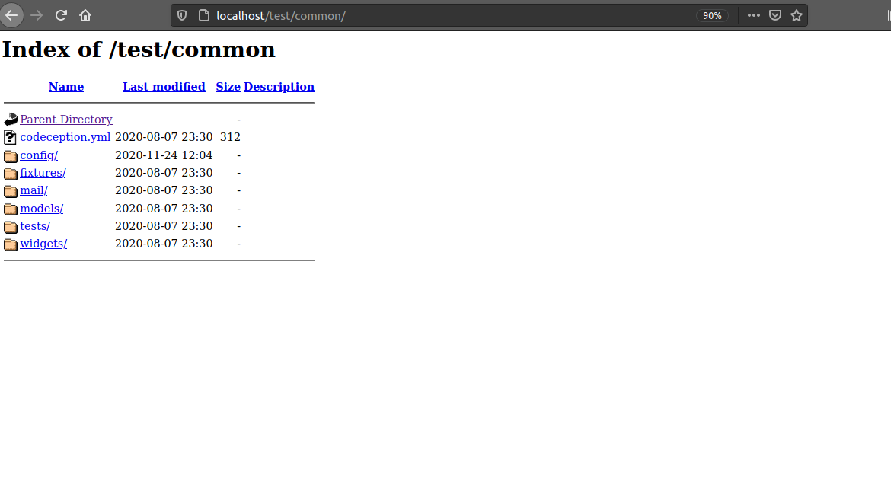

## Php yii2 Web Application framework.
 
Nowadays,many people has turned out to use framework in web designing and apps development. This has played a great role in improving developers codding skill since they done have to have the whole knowledge of a language so as to use it.
PHP is an acronym for "PHP: Hypertext Preprocessor".It is a server side scripting language that is embedded in HTML. It is used to manage dynamic content, databases, session tracking, even build entire e-commerce sites.
It is integrated with a number of popular databases, including MySQL, PostgreSQL,
Oracle, Sybase, Informix, and Microsoft SQL Server.
takeaway
## Introduction
Yii is a generic Web programming framework best for developing complex Web applications with multiple ties.
It is used together with database.When developing webs with yii2, you need to be familia with php classes and objects.
Like other PHP frameworks,Yii implements the MVC (Model-View-Controller) . 

MVC aims to separate business logic from user interface considerations, so that developers can more easily change each part without affecting the other. 

    1 Model
     Models represent the information (data) and the business rules.They are often shared among different sub-applications of a Web application. For example, a LoginForm model may be used by both the front end and the back end of an application.
     Models should;

     - contain properties to represent specific data.

     - contain business logic(eg validation riles)to ensure the represented data fulfills the design requirement.
     
     - avoid direct access to $_GET, $_POST, or other similar variables that represent the end user request.

     2 Views
     Views are responsible in representing models in the format that end users desire.

     Views should;
     -  mainly contain presentational code, such as HTML, and simple PHP code to traverse, format and render data.
     - avoid containing code that performs explicit DB queries. Such code is better placed in models.
     - avoid direct access to $_GET, $_POST, or other similar variables that represent the end user request.

     3 Controller
     (link(Controller[https://www.yiiframework.com/doc/guide/1.1/en/basics.controller])) binds models,views and other components together into a runnable application.RThey are responsible for dealing with directly with end user request. Therefore,controllers

     - may access $_GET, $_POST and other PHP variables that represent user requests;

     - should avoid containing any HTML or any other presentational markup. This is kept in views.

     - may create model instances and manage their life cycles. For example, in a typical model update action, the controller may first create the model instance; then populate the model with the user input from $_POST; after saving the model successfully, the controller may redirect the user browser to the model detail page.

It include three tiers:frontend,backend and console, each of which is a separate Yii console.

- front end: it is a public-facing website for normal end users.

- back end: it exposes administrative functionality for managing the application. It is restricted to administrative staff.

- console: an application consisting of console commands to be run in a terminal window or as scheduled jobs to support the whole application.

In this article we are going to focuses on frontend. 

## Requirements
To follow along with this tutorial,you need to; 
- install a code editor like sublime or vscode.feel free to use any other. 
- install yii2.Procedures of installing are well described in this article.
- have some knowledge of html and css 
-knowledge of OOP (Object oriented programming). This means classes, overriding functions, using constructor, public and private methods and properties.
- be familiar with PHP and databases (DB) .
- have Web server supports PHP 5.6.0.Yii2 is a PHP( server side scripting language) framework therefore it require a web server support.
 
## step 1- install yii2
Yii is installed in two ways, using the Composer package manager or by installing it from an archive file. The former is the recommended way, as it enables you to install new extensions or update Yii by a single command.

## 1. install via composer
If you do not have a composer with you in your PC you may install it by following the instruction at https://getcomposer.org/download/.
On linux and Mac OS X, you will run the following commands:

```bash
$ curl -sS https://getcomposer.org/installer | php
$ sudo mv composer.phar /usr/local/bin/composer
$ sudo chmod +x /usr/local/bin/composer
```

On Windows,you'll download and run https://getcomposer.org/Composer-Setup.exe.

If you encounter a problem,please refer to https://getcomposer.org/doc/articles/troubleshooting.md

<!-- ## installing yii -->
Once you have composer installed, move into the directory /var/www/html/ which will store your web applications or websites files, then install the Yii package using the composer (replace testproject with the name of your web application’s directory). 
```bash
$ cd /var/www/html/
$ composer create-project --prefer-dist yiisoft/yii2-app-basic testproject

```
<!-- break down the command above -->
The command above will install the latest version of YII in the basic directory.
In case of an error,please refer[Troubleshooting section of th Composer Documentation](https://getcomposer.org/doc/articles/troubleshooting.md),then resume to the installation by running composer updates inside of the basic directory.

<!-- Once your done with installation you can rename the yii2 into your favorite name.  In this case we will rename it to test. can you show us how to do that?
i don't think it's fine to combine project creation with installation, finish the installation then show us how to create a yii2 project!  -->
## 2. install from an archive file.
This Involves three steps;

1.Download the archive file from [yiiframeworks.com](https://www.yiiframework.com/download).

2.Unpack the download file to a web-accessible folder. <!-- what is a web accessible folder? -->

3.Modify the config/web.php file by entering a secret key for the cookieValidationkey configuration item.
<!-- if cookieValidationkey is a name then put it under some code blocks -->
NB if you install yii using composer this will done automatically for you. <!-- specify what "this" stands for -->
```php
// !!! insert a secret key in the following(if it is empty) - this is required by cookie validation
'cookieValidationKey' =>'enter you secret key here',
```
 ## step2 verify the installation
 At this point, you are ready to start using the Yii framework for development. 
 After your done with the installation,you can either configure your web server or use the build in server[bult-in-web server](https://www.php.net/manual/en/features.commandline.webserver.php)by running the following command in you terminal while in the project directory .
 
 ```bash
 $ php yii serve
 ```

 ### Understanding the Folder Structure and directories
 
 First, let's check what happens when we just open the advanced template in the browser. So now if you have put the advanced directory correctly into the document root, you can visit your localhost/advanced <!-- what is localhost/advanced, a link? how do you visit that? in a terminal? -->
 NB.You can rename  the `advanced` from `advanced` to any favorite name that you think about.later we will see how we rename.In our case lets rename the `advanced` from `advanced` to `test`.
You should see the following directories on your code editor; 
```bash
/
	backend/
	common/
		components/
		config/
			params.php
			params-local.php *
		lib/
			Pear/
			yii/
			Zend/
		migrations/
		models/
			Comment.php
			Extension.php
			...
	console/
		commands/
			SitemapCommand.php
			...
		config/
			main.php
			main-local.php *
			params.php
			params-local.php *
		runtime/
		yiic.php *
	frontend/
		components/
		config/
			main.php
			main-local.php *
			params.php
			params-local.php *
		controllers/
			SiteController.php
			...
		lib/
		models/	
			ContactForm.php
			SearchForm.php		
		runtime/
		views/
			layouts/
			site/
		www/
			assets/
			css/
			js/
			index.php *
	yiic
	yiic.bat

```
<!-- use tree linux program to draw the folder structure -->
Here, we will cover the just the necessary directories and files. In advanced series.
At the top level, we have four directories;
<!-- explain each and every file and directory in here -->
- backend
While development of any web application, we have two things to be considered, the consumer/user facing side of the website and the admin panel or the dashboard.
The backend directory serve the service of admin or the services which are restricted from the users.
Now lets see whats inside the backed..Click the backed is this is what you should see. <!--a little research and grammar would improve thing in here. consider looking up the folder structure from Yii2 docs or somewhere in Google -->

## assets
This directory consists the configurations for the assets managed in the backend project. By default, it has AppAsset.php file inside, which includes the configurations of the javascript and the css files.This is where we will adding all our css and js styles link
## controllers
In the MVC Pattern of coding, the C stands for Controllers. These controllers are present in the controller's directory. Yii follows the convention of <NameController> for naming the controllers. Example, UserController.php is the name of the file and the class is UserController.
## models
Models are the classes which contain the 'business logic'. When we say business logic it's the processing of data, manipulating the values, etc. In Yii, this directory also has classes which are a link to the Database through which we can access the database tables. These models and tables have one to one mapping.
## views
Views store the files which are displayed via a browser. The data is passed from the controller in the view and then sent to the browser in HTML format. Thus separating the business logic in Models and display logic in Views. 

Inside views we have two directories;
1. **layout**

In this directory we have the files that we will always get displayed on the web page.This files are mainly the navigation bar and the footer .To prove this click either about or login and notice that it will take you to the about page and login page respectively but the entire navigation  bar will remain.

The files in this directory are under main.php folder .In our case this is the codding we have under main.php;

<!-- stop proving things. instead research and put down facts. your grammar needs a checkup too -->
```php
//  <?php

// /* @var $this \yii\web\View */
// /* @var $content string */

// use yii\helpers\Html;
// use yii\bootstrap\Nav;
// use yii\bootstrap\NavBar;
// use yii\widgets\Breadcrumbs;
// use frontend\assets\AppAsset;
// use common\widgets\Alert;

// AppAsset::register($this);
// ?>
// <?php $this->beginPage() ?>
// <!DOCTYPE html>
// <html lang="<?= Yii::$app->language ?>">
// <head>
//     <meta charset="<?= Yii::$app->charset ?>">
//     <meta http-equiv="X-UA-Compatible" content="IE=edge">
//     <meta name="viewport" content="width=device-width, initial-scale=1">
//     <?php $this->registerCsrfMetaTags() ?>
//     <title><?= Html::encode($this->title) ?></title>
//     <?php $this->head() ?>
// </head>
<body>
<?php $this->beginBody() ?>

<div class="wrap">
    <?php
    NavBar::begin([
        'brandLabel' => Yii::$app->name,
        'brandUrl' => Yii::$app->homeUrl,
        'options' => [
            'class' => 'navbar-inverse navbar-fixed-top',
        ],
    ]);
    $menuItems = [
        ['label' => 'Home', 'url' => ['/site/index']],
        ['label' => 'About', 'url' => ['/site/about']],
        ['label' => 'Contact', 'url' => ['/site/contact']],
    ];
    if (Yii::$app->user->isGuest) {
        $menuItems[] = ['label' => 'Signup', 'url' => ['/site/signup']];
        $menuItems[] = ['label' => 'Login', 'url' => ['/site/login']];
    } else {
        $menuItems[] = '<li>'
            . Html::beginForm(['/site/logout'], 'post')
            . Html::submitButton(
                'Logout (' . Yii::$app->user->identity->username . ')',
                ['class' => 'btn btn-link logout']
            )
            . Html::endForm()
            . '</li>';
    }
    echo Nav::widget([
        'options' => ['class' => 'navbar-nav navbar-right'],
        'items' => $menuItems,
    ]);
    NavBar::end();
    ?>

    <div class="container">
        <?= Breadcrumbs::widget([
            'links' => isset($this->params['breadcrumbs']) ? $this->params['breadcrumbs'] : [],
        ]) ?>
        <?= Alert::widget() ?>
        <?= $content ?>
    </div>
</div>

<footer class="footer">
    <div class="container">
        <p class="pull-left">&copy; <?= Html::encode(Yii::$app->name) ?> <?= date('Y') ?></p>

        <p class="pull-right"><?= Yii::powered() ?></p>
    </div>
</footer>

<?php $this->endBody() ?>
</body>
</html>
<?php $this->endPage() ?>

```
To have the best navigation bar and the footer other than the one yii2 have provided,edit the content inside the body.For example You may modify the menuitems to customize its content  lets say services.you will do that in this part below;
<!-- to modify, not to have the best ... -->
```php
 $menuItems = [
        ['label' => 'Home', 'url' => ['/site/index']],
        ['label' => 'About', 'url' => ['/site/about']],
		['label' => 'Contact', 'url' => ['/site/contact']],
		 ['label' => 'Services', 'url' => ['/site/sevices']],
```

2) Site
As you can see above we have site/contacts,site/services etc..Its now time to see what this site is all about. <!-- reword "as you can see!" I'm blind asf -->
When for example you click about in the navigation bar,you wil be taken to about page.The files of this page are in about.php,a folder in site directory.Therefore we can say thet site store the files which are displayed via a browser but unlike layout the files are not fixed when opened in the browser. <!--reword "when for example"-->
In our case, we have the following;
```php
<?php

/* @var $this yii\web\View */

use yii\helpers\Html;

$this->title = 'About';
$this->params['breadcrumbs'][] = $this->title;
?>
<div class="site-about">
    <h1><?= Html::encode($this->title) ?></h1>

    <p>This is the About page. You may modify the following file to customize its content:</p>

    <code><?= __FILE__ ?></code>
</div>
```
As you can see above your directed on the part to modify.This is the part that you wiil add everything that you want to be in your about page..Lets modify our about page and see what will happen. <!-- I can't see. I'm blind!. Stop seeing -->

## common
This is a directory which is located inside test(my project name which I renamed from advanced) directory. <br>
Lets have a look at it.



As the name suggests, the common directory has the config, models, etc. which are used in the backend and the frontend projects. For example, you can have database configuration in common/config if, both of them uses the same database. We we look at database configuration later as we move forward.

1. **frontend**

The frontend application which provides the main interfaces to our target end users.
Frontend has similar directories to those of backend <!--grammar !!-->
<!-- -console-the console application that consists of the console commands needed by the system.
-common-the directory whose content are shared among the above applications. -->

In our case we will give more attention to the frontend directory. <!-- Create an app using Yii and stop modifying files without telling us what you want to achieve -->

## Database configuration
As we had said we would look at the database configuration as we move forward.Its now the time. <!--😂😂! aty it's time? remove that! you are writing a tutorial!-->
Edit the file config/main-local.php in the Backend directory:
You should see the following:

```php
<?php
return [
    'components' => [
        'db' => [
            'class' => 'yii\db\Connection',
            'dsn' => 'mysql:host=localhost;dbname=yii2advanced',
            'username' => 'root',
            'password' => '',
            'charset' => 'utf8',
        ],
        'mailer' => [
            'class' => 'yii\swiftmailer\Mailer',
            'viewPath' => '@common/mail',
            // send all mails to a file by default. You have to set
            // 'useFileTransport' to false and configure a transport
            // for the mailer to send real emails.
            'useFileTransport' => true,
        ],
    ],
];
```

NOTES:

- Yii won't create the database for you, this has to be done manually before you can access it. <!-- show us how! or give us a resource on how to do the same -->
- Check and edit the other files in the config/ directory to customize your application as required. <!--what other files?-->
- edit this line `'dsn' => 'mysql:host=localhost;dbname=yii2advanced'`, and rename the `dbname` from `yiiadvanced` to `test`. <!--okay! where is this found? in which file?-->

## step 3  accessing the installed Yii application using a browser
Its time to test whether the installed yii is working.You use your browser to access the installed Yii application. Open your browser and navigate http:localhost/test.
Nb test is the name that we renamed our yii advanced name to.
You should first see the following directory; <!--Don't put NBs, instead put block quotes eg. "> Test is the name ..." -->
```bash
Index of /test
[ICO]	Name	Last modified	Size	Description
[PARENTDIR]	Parent Directory 	 	- 	 
[ ]	LICENSE.md 	2020-08-07 23:30 	1.5K	 
[ ]	Vagrantfile 	2020-08-07 23:30 	2.6K	 
[DIR]	backend/ 	2020-08-07 23:30 	- 	 
[ ]	codeception.yml 	2020-08-07 23:30 	167 	 
[DIR]	common/ 	2020-08-07 23:30 	- 	 
[ ]	composer.json 	2020-08-07 23:30 	1.4K	 
[ ]	composer.lock 	2020-08-07 23:31 	169K	 
[DIR]	console/ 	2020-08-07 23:30 	- 	 
[ ]	docker-compose.yml 	2020-08-07 23:30 	864 	 
[DIR]	environments/ 	2020-08-07 23:30 	- 	 
[DIR]	frontend/ 	2020-08-07 23:30 	- 	 
[ ]	init 	2020-08-07 23:30 	8.6K	 
[ ]	init.bat 	2020-08-07 23:30 	319 	 
[ ]	requirements.php 	2020-08-07 23:30 	5.7K	 
[DIR]	vagrant/ 	2020-08-07 23:30 	- 	 
[DIR]	vendor/ 	2020-08-07 23:31 	- 	 
[ ]	yii 	2020-11-22 22:36 	717 	 
[ ]	yii.bat 	2020-08-07 23:30 	323 	 
[ ]	yii_test 	2020-11-22 22:36 	928 	 
[ ]	yii_test.bat 	2020-11-22 22:36 	328 	 
```
Inside frontend directory click the web directory and if the installation was successful you should  see the below "Congratulations!" page in your browser. 


## Congratulation for creating your first yii program.
Nb-If you don't get a congratulation note,just go back a little and follow the steps. 

## Step 4 Creating our first web application using yii 
Now that we have yii installed and working in our pc lets create our first yii frontend project.
We will start by creating the navigation bar.In our view directory we will open main.php under layout file and  enter the following;
```html
      <div>
<a style="padding-right: 20px"  href="<?= Yii::$app->urlManager->createUrl(['site/index'])?>">  Home</a>
      <li> <a style="padding-right: 20px"  href="<?= Yii::$app->urlManager->createUrl(['site/contacts'])?>">  Contacts</a> </li>
      <li> <a style="padding-right: 20px"  href="<?= Yii::$app->urlManager->createUrl(['site/about'])?>">  about</a> </li>
       <li> <a style="padding-right: 20px"  href="<?= Yii::$app->urlManager->createUrl(['site/signup'])?>">  sigh up</a> </li>> nv
        <li> <a style="padding-right: 20px"  href="<?= Yii::$app->urlManager->createUrl(['site/login'])?>">  login</a> </li>
      <br>
```
In the above code we have used PHP URL manager to root.
As we had discussed earlier about styles all your styles should be under the directory assets.You add all the css and js styles that you wish to.
```css
{
    public $basePath = '@webroot';
    public $baseUrl = '@web';
    public $css = [
        'css/site.css',
        'css/bootstrap.min.css',
        'css/styles.css',
    ];
    public $js = [
 
```
In our case all the style are in css folder and that how we will be linking  them.

## Body
Now lets design the body..This will be done inside the index.php file which is in the site directory.
This file contains the entire page of the website..
When we modify the index.php file we will have;
```html
<section id="introText">
  <div class="container">
    <div>
       <h3 class="panel-title" style="text-align: center"> <strong>Welcome</strong> </h3>  
         <P>
          Wow!Iam proud of myself,I have just created my first project using yii2.
         </P>
      <p> </p>
    </div>
   </div>
   </section> 
```
### Is framework important when codding?
This one depends on you as an individual,some people  will prefer framework while others won't.However,I would recommend someone to use framework especially the beginners since;
1. it is easy to install
2. encourages testing
3. utilizes modern technology


### conclusion
    Like any other good framework,Yii help you create modern web application quickly and make sure they
    perform well.It pushes you to create securable and testable site by doing a lot of the heavy lifting for you.
    I really encourage you to check it out for the next web project..

    Have You tried yii2??Why not?Try today!


<!--
    Notes:
    - Did you check your article for grammar? Because there's a lot of grammar issues in here
    - Your links don't start with "http://" which is wrong
    - Some of your variable names are inconsistently named. consider re-checking this
    - This tutorial only touches on installation and modifying some files. Is there more basics that you can add or what?
    - I didn't check code correctness. I'll do that after you make the above changes
    - your step 4 leaves us hanging. Did you finish this article? where is the conclusions?
-->

